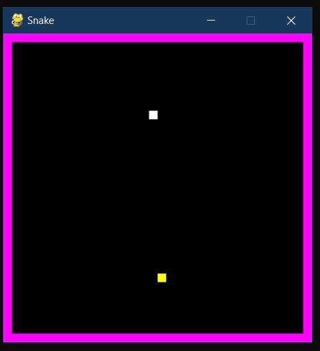

# BASIC-PYTHON-PROJECTS-

HERE ALL THE PROJECTS ARE RELEATED TO PYTHON 
---------------------------------------------

1. SNAKE BITE (GAME)
  > Move the snake to different directions while catching the objects appearing and growing in size without crashing to the walls.
  > 
  > 

 
